# 🌐 Youverse – Nền tảng Blog Cá Nhân & Cộng Đồng

Youverse là hệ thống website blog đa năng được xây dựng bằng Laravel 11 và hướng đến việc tạo ra một không gian chia sẻ dành cho cá nhân và cộng đồng.
Người dùng có thể viết bài blog, tạo nhóm, tương tác xã hội, chat thời gian thực, quản lý nội dung cá nhân và xem thống kê chi tiết.

## 📌 1. Giới thiệu dự án

Youverse là nền tảng viết blog với các tính năng hiện đại:

Đăng bài / lưu nháp / lên lịch đăng

Theo dõi, kết bạn, nhắn tin

Tạo nhóm cộng đồng

Gợi ý bài viết bằng AI (embedding)

Thông báo realtime

Hệ thống quản trị mạnh mẽ

## ✨ 2. Tính năng nổi bật
* 👤 Người dùng khách (chưa đăng nhập)

Đăng ký tài khoản

Đăng nhập hệ thống

* 🔐 Tài khoản & Bảo mật

Đăng nhập / Đăng xuất

Đổi mật khẩu

Quên mật khẩu (qua email)

* 📝 Quản lý bài viết

Tạo bài viết (Nháp / Công khai)

Chỉnh sửa, xóa bài viết

Xem chi tiết bài viết

Báo cáo bài viết vi phạm

Đặt lịch đăng bài

Upload nhiều ảnh trong bài viết

* 📁 Thư mục cá nhân

Tạo thư mục

Xem bài viết của từng thư mục

* 🙍‍♂️ Thông tin cá nhân

Xem thông tin

Đổi tên

Cập nhật avatar & ảnh bìa

Cập nhật trạng thái cá nhân

* 💬 Tương tác xã hội

Gửi lời mời kết bạn

Chấp nhận / từ chối lời mời

Nhắn tin thời gian thực (Laravel Echo + Pusher)

Like & bình luận

Xóa bình luận bản thân

* 🧩 Nội dung ngắn

Đăng & xóa dòng trạng thái

Tạo & xóa chủ đề thảo luận

* 👨‍👩‍👧‍👦 Nhóm cộng đồng

Tạo nhóm

Tìm kiếm & tham gia nhóm

Rời nhóm

Mời thành viên

Xóa nhóm (nếu là chủ nhóm)

* 🔍 Tìm kiếm & đề xuất

Tìm người dùng theo ID / email

Tìm bài viết theo tiêu đề / mô tả

Gợi ý bài viết liên quan bằng embedding (AI mini)

* 📊 Thống kê cá nhân

Tổng bài viết

Bài nháp

Lượt thích

Lượt xem

Số bạn bè

Bình luận đã viết

Bài viết bị báo cáo

Nhóm đang tham gia

## 🛠 3. Chức năng của quản trị viên (Admin)

Quản lý người dùng (khóa/mở khóa)

Gửi thư hệ thống đến người dùng

Xử lý bài viết bị báo cáo

Xóa bài viết vi phạm

Quản lý chủ đề, dòng trạng thái

Quản lý nhóm người dùng

Quản lý thông báo hệ thống

Cài đặt chung của hệ thống

Thống kê toàn hệ thống

## 🧱 4. Công nghệ sử dụng

| Nhóm Công nghệ | Công cụ/Phiên bản | Chi tiết|
| :--- | :--- | :--- |
| **Backend Core** | PHP 8.2 | Laravel 11, MySQL 8 |
| **Kiến trúc** | **OOP** | Áp dụng mô hình **MVC** (Model-View-Controller) |
| **Frontend** | HTML5, CSS3, JavaScript | jQuery, Bootstrap 5, Blade Template |
| **Thời gian Thực** | **Laravel Echo** | Tích hợp với **Pusher.com** cho tính năng chat và thông báo trực tiếp. |
| **Xử lý Bất đồng bộ** | **Queue – Job** | Sử dụng driver Database để xử lý các tác vụ nền. |
| **Hệ thống Thông báo** | **Laravel Notification** | Hỗ trợ kênh Email, Database, và Pusher (realtime). |
| **Hệ thống đề xuất bài viết** | SentenceTransformer, Cosine Similarity | Sử dụng `all-MiniLM-L6-v2` cho quá trình tạo embedding, Tính toán trong Laravel sau khi lưu embedding dạng JSON trong MySQL.|
| **Biểu đồ** | Chart.js | Dùng để hiển thị thống kê hệ thống và cá nhân. |
## Màn hình giao diện

### Landing-page
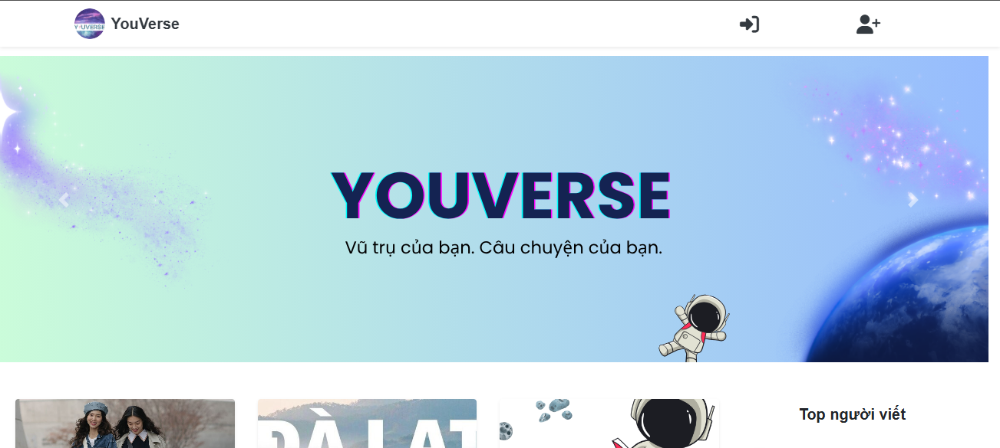

### Trang chủ

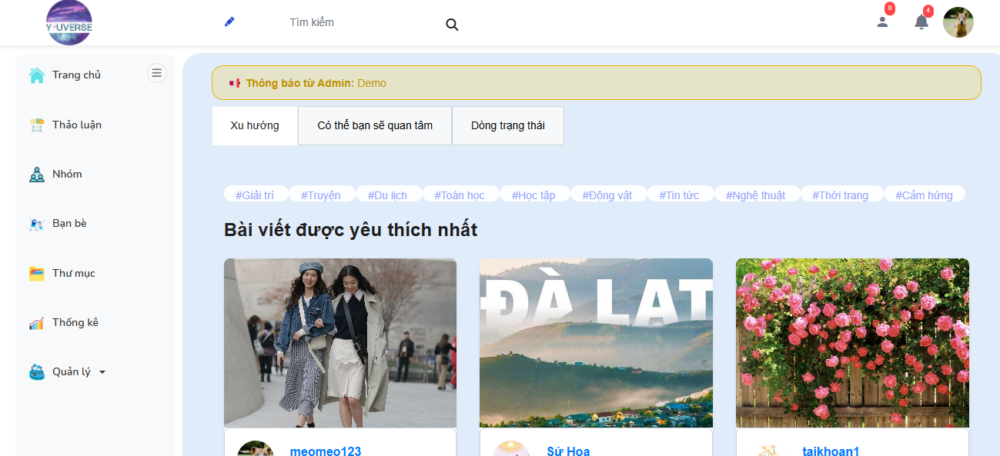

### Đăng nhập

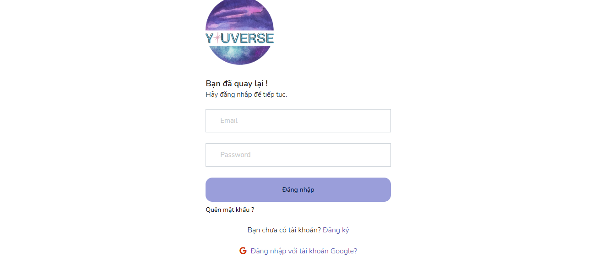

### Trang tài khoản

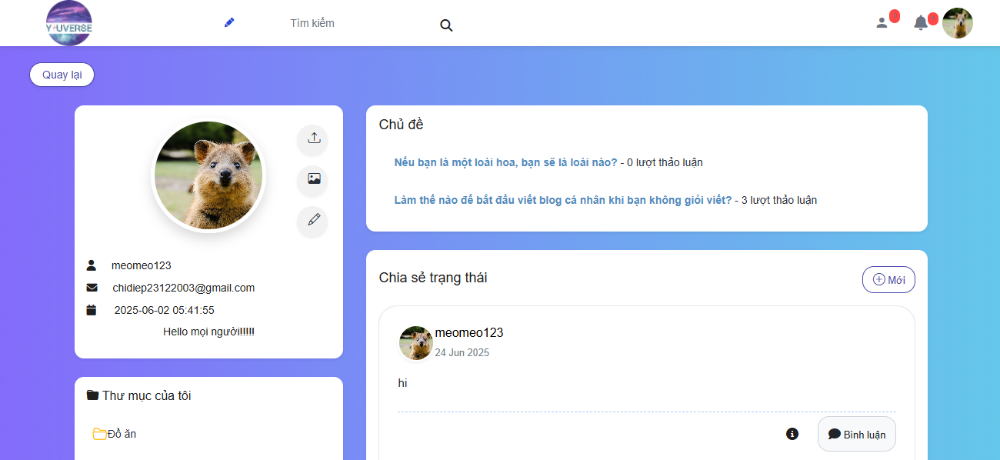

### Nhóm

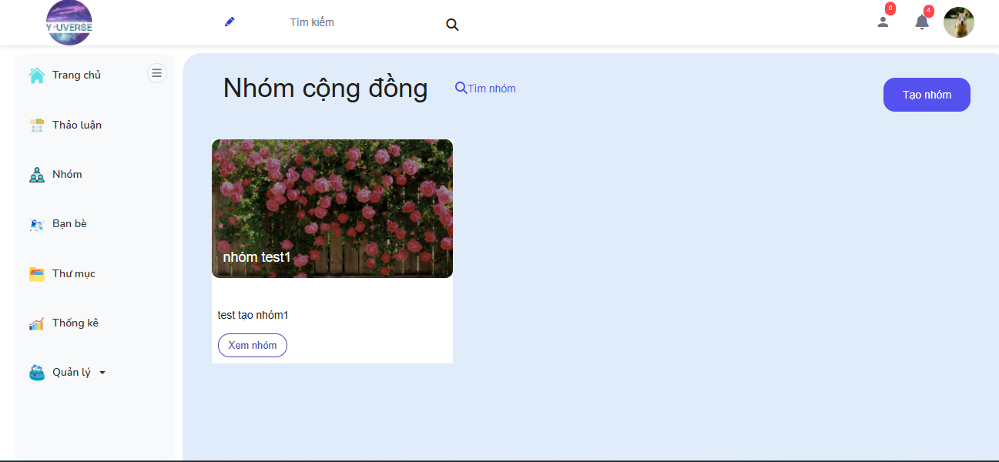

### Diễn đàn

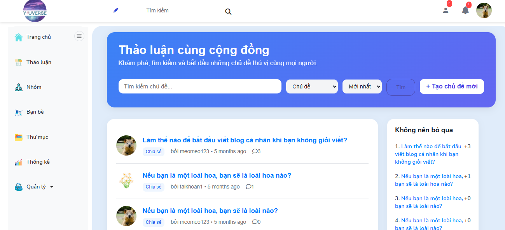

### Trang thống kê - user

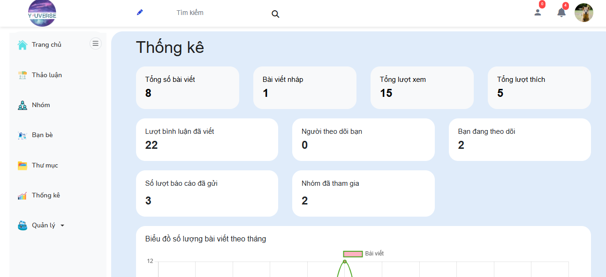

### Tố cáo bài viết

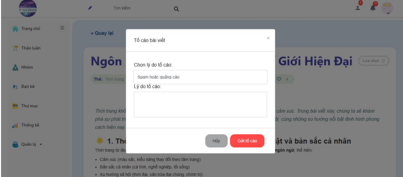

###Admin site

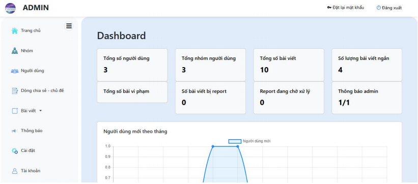

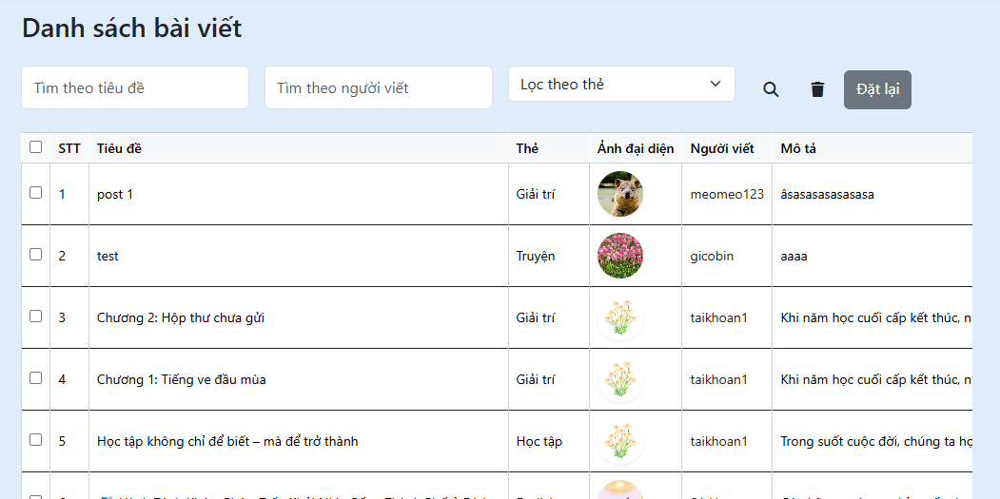

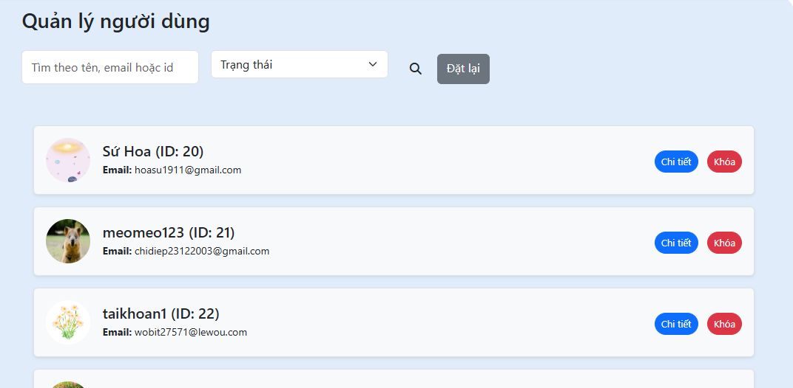

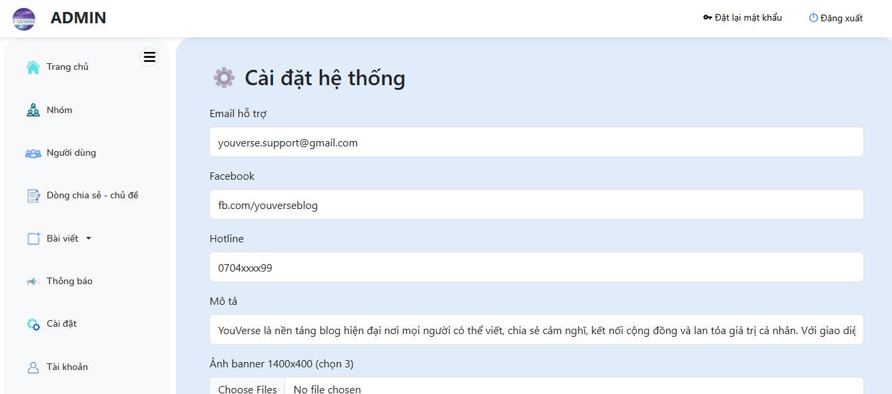
